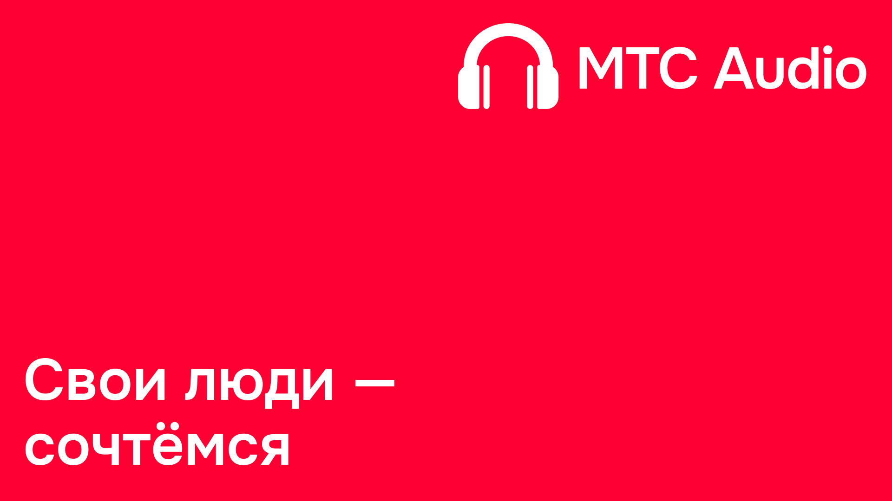

# MTSAudio
# Preview
[](https://www.youtube.com/watch?v=SdEkTDmO7io&ab_channel=%D0%A1%D0%B2%D0%BE%D0%B8%D0%BB%D1%8E%D0%B4%D0%B8-%D1%81%D0%BE%D1%87%D1%82%D0%B5%D0%BC%D1%81%D1%8F)

## !!Warning!!
Весь рабочий и не слишком рабочий код располагается в ветке `main`.

## Server start
Для запуска сервера выполните следующие команды:
```bash
cd server
docker-compose up
```

## Mobile start
Следует открыть директорию `Mobile` в AndroidStudio.
Для запуска мобильной версии приложения выполните следующие команды:
```bash
Build -> Clean Project
Build -> Rebuild Project
```
Запускать эмуляторы на ***одном устройстве с сервером***

## Desktop start
Для запуска десктопной версии приложения выполните следующие команды:
```bash
cd desktop
npm install
cd mts-app
ng serve --open
```
